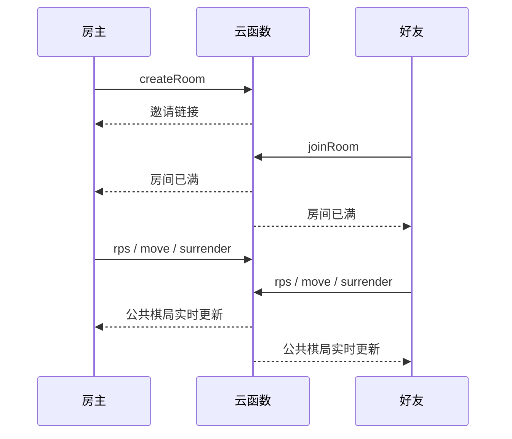

# 揭棋联机版最小架构（v0.1）

状态：已定方案，等待实现。  
目标：两名朋友通过邀请链接进行一局揭棋；不做账号体系、聊天、排行榜或观战。

## 1. 平台决定

首版采用 **腾讯云 CloudBase（上海环境）**：

- 静态网站托管：承载现有 H5；
- 云函数：唯一的权威裁判；
- 文档数据库：保存房间和断线状态；
- 数据库 `watch()`：把公共棋局实时推送给两名玩家；
- 匿名登录：给浏览器分配稳定但不要求注册的玩家 ID。

这样不需要维护常驻 Node 服务器。云函数空闲时不产生计算费用，文档数据库支持服务端事务与实时监听；Web SDK 可用于普通网页和微信 H5。

正式面向中国大陆公开访问时，再配置域名和备案。联机开发与好友测试阶段不把备案作为前置阻塞项。

## 2. 不可突破的边界

1. `identities`（暗子真实身份）只存在服务端私有记录与云函数内存中，绝不进入浏览器、实时推送或日志响应。
2. 浏览器不能直接写任何棋局；所有改变棋局的操作都只能调用云函数。
3. 每个落子携带 `expectedRevision` 与 `actionId`；云函数用事务检查并写入一次。
4. 本地 v0.4.0 是冻结试玩基线。联机层复用其规则引擎，不改写已确认规则。

## 3. 最小房间流程



1. 房主打开网页后匿名登录，调用 `createRoom`。
2. 服务端创建 `roomId` 和不可预测的邀请口令；网页提供“复制邀请链接”。
3. 好友打开链接后匿名登录，调用 `joinRoom`。房间仅允许两人；满员后拒绝其他人。
4. 双方按现有规则秘密猜拳；云函数确定红方与先手。
5. 所有落子、臣服和终局自动演出由云函数产生唯一结果；客户端只渲染公共状态。

## 4. 数据模型

### `rooms_public/{roomId}`（客户端只读、实时监听）

```ts
{
  roomId: string,
  phase: "waiting" | "rps" | "playing" | "finished",
  seats: {
    host: { playerId: string, connectedAt: number, lastSeenAt: number },
    guest?: { playerId: string, connectedAt: number, lastSeenAt: number }
  },
  rps: RpsPublicState,
  state?: GameState, // 只能是 publicStateSnapshot 的结果
  terminalAnimation?: {
    eventId: string,
    reason: "ambush" | "checkmate", // 页面显示为「背刺」或「裁决」
    plan: AutomaticExecutionPlan // 已揭攻击子的起点、终点和 ID
  },
  updatedAt: number
}
```

### `rooms_secret/{roomId}`（客户端无读取和写入权限）

```ts
{
  inviteTokenHash: string,
  rpsSecret: RpsSecretState,
  gameSecret?: SecretState, // identities 与 processedActions
  disconnect?: { side: Side, deadlineAt: number } // 后续断线规则定稿后启用
}
```

公共和私有记录由同一云函数事务一起更新，避免出现“棋盘更新了但暗子身份没有同步”的中间状态。

## 5. 云函数接口

| 接口 | 调用者 | 作用 |
|---|---|---|
| `createRoom` | 房主 | 创建房间、生成邀请口令 |
| `joinRoom` | 受邀好友 | 校验口令并占用第二席 |
| `getRoom` | 任一席位 | 刷新后恢复公共状态 |
| `submitRps` | 当前出拳者 | 提交秘密出拳并推进回合 |
| `submitMove` | 当前行动方 | 事务校验、落子、翻子、判定终局 |
| `surrender` | 任一席位 | 触发「臣服」 |
| `heartbeat` | 任一席位 | 更新 `lastSeenAt` |
| `claimDisconnect` | 在线方 | 断线规则定稿后，校验超时并触发「虚空放逐」 |

`submitMove` 的服务端顺序固定为：读取私有身份 → 调用 `applyAuthoritativeMove` → 若进入 `execution`，先记录 `AutomaticExecutionPlan`，再立即调用 `applyAutomaticExecution` → 同事务写回 `rooms_secret` 与 `rooms_public`。

因此背刺和裁决在网络状态中也不会留下“等待胜者点击”的空档。

写入的是已经结束的棋局；但 `terminalAnimation` 会一起给出刚刚执行的攻击路线。两个客户端收到同一条更新后，先根据该路线播放自动吃将动画与对应特效，再显示胜利文案。它不含暗子身份，也不要求客户端再向服务端发起“确认终结”的请求。

## 6. 断线规则的待定项

已定名称与文案：**虚空放逐**。

> 对方意外遭遇阿克蒙德，并不慎触怒了他。  
> 已被流放至扭曲虚空。

尚未定稿、因此暂不实现：

- 断线多久后可判负；
- 重连后是否取消倒计时；
- 双方同时断线时如何处理。

在此之前，联机首版只记录在线时间，不会因为短暂网络波动自动判负。

## 7. 实现顺序

1. 抽出 CloudBase 适配层和上述数据契约；
2. 实现房间创建、加入、公共状态恢复；
3. 迁移猜拳与权威落子；
4. 接入实时监听，并用两个浏览器验证同步；
5. 断线规则定稿后再实现心跳与「虚空放逐」。

## 8. 验收标准

- 两个浏览器通过同一邀请链接进入同一房间；
- 任一浏览器刷新后恢复同一棋盘、轮次和结果；
- 非房间玩家、非当前行动方、过期版本和重复 `actionId` 均被拒绝；
- 任意浏览器的网络响应、数据库监听和页面内存中均找不到未翻暗子的真实颜色或兵种；
- 背刺与裁决由服务端自动完成，两个浏览器看到相同终局结果。

## 资料

- [CloudBase 云函数](https://docs.cloudbase.net/cloud-function/introduce)
- [CloudBase 实时推送](https://docs.cloudbase.net/database/realtime)
- [CloudBase 服务端事务](https://docs.cloudbase.net/database/transaction)
- [CloudBase Web SDK](https://docs.cloudbase.net/en/api-reference/webv2/initialization)
- [腾讯云备案流程](https://cloud.tencent.com/product/ba)
